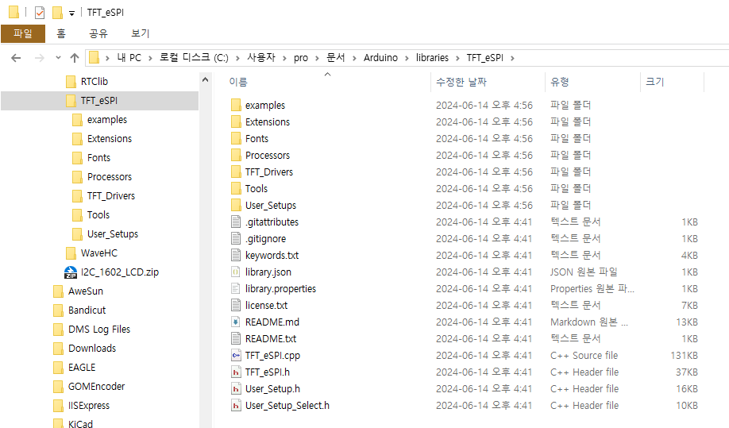
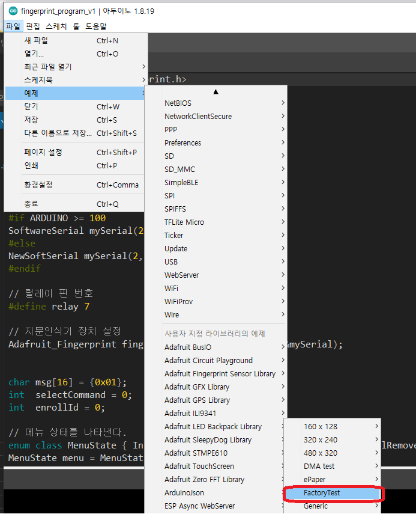
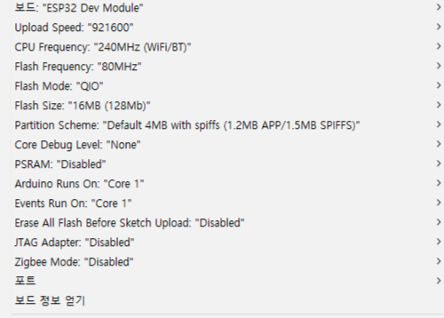
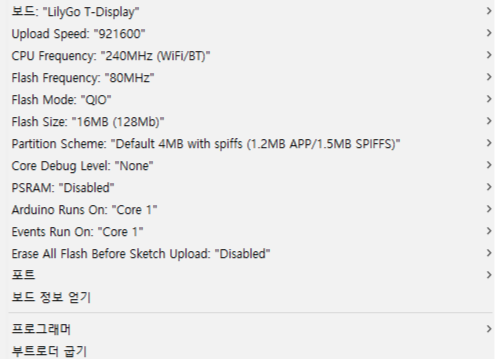
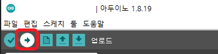

# TTGO T-Display

## Quick start

1. **USB 드라이버를 설치한다.**, [CHxxx Series MAC driver](http://www.wch-ic.com/downloads/CH34XSER_MAC_ZIP.html) , [CHxxx Series Windows driver](http://www.wch-ic.com/downloads/CH343SER_ZIP.html),[CP21xx Series driver](https://www.silabs.com/developers/usb-to-uart-bridge-vcp-drivers?tab=downloads)

2. 이 저장소에 있는 **TFT_eSPI** 폴더를  **<C:\Users\Your User Name\Documents\Arduino\libraries>**  폴더로 복사한다.

3. **Arduino IDE**를 실행하고, **File** 메뉴 하위에 있는 **example** 의 서브 메뉴인   **TFT_eSPI**를 찾는다. **T-Display** 의 factory test program 은 **TFT_eSPI -> FactoryTest** 에 있다. 또한 TFT_eSPI 에서 제공하고 있는 다른 예제 프로그램도 사용할수 있다.

4. **Arduino IDE** tool 메뉴에서 **development board**를 선택한다. **ESP32 Dev Module**를 선택하고, **PSRAM 옵션은 Disable** 설정한다. 그리고 **Flash Size 옵션은 4MB 또는 16MB를 구매한 제품의 Flash 사이즈에 맞게 설정한다.**, 다른 옵션은 default를 유지한다.

5. 만약 ESP32 라이브러리를 최신 버전을 사용하고 있다는 **LilyGo T-Display** development board가 존재하므로 이 보드를 선택해도 된다.

6. 시리얼 포트(serial port)를 연결하고 대응되는 포트를 선택한다. 여러개의 포트가 동작하고 있어서 명확하지 않을 때는 모든 시리얼 포트를 제거하고 USB로 보드와 연결하여 해당포트를 확인하고 선택한다.

7. 마지막으로 체크 버튼 옆에 있는 화살표 버튼을 클릭하여 업로드를 수행한다.

-------------------------
## SD card 연결
- SD 카드를 데모 장치로 사용하여 두번째 SPI 장치를 이용하는 방법을 시연한 예입니다.

## Pinout
| Name       | V18    |
| ---------- | ------ |
| TFT Driver | ST7789 |
| TFT_MISO   | N/A    |
| TFT_MOSI   | 19     |
| TFT_SCLK   | 18     |
| TFT_CS     | 5      |
| TFT_DC     | 16     |
| TFT_RST    | 23     |
| TFT_BL     | 4      |
| I2C_SDA    | 21     |
| I2C_SCL    | 22     |
| ADC_IN     | 34     |
| BUTTON1    | 35     |
| BUTTON2    | 0      |
| ADC Power  | 14     |
