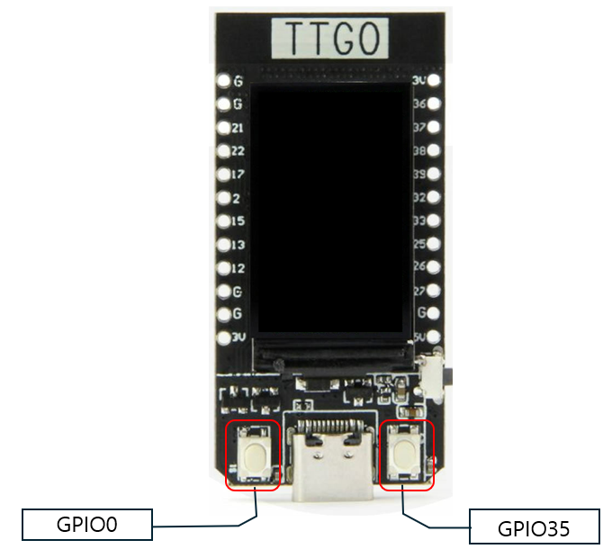

# 설명

엄밀히 말해서 이 코드는 **TFT_eSPI** 라이브러리를 이용한 코드가 아니다. **TFT_eSPI** 예제 코드중 하나인 **FactoryTest** 프로그램에 포함되어 있는 **Button2** 코드를 사용하는 것이다.

Button 은 다양한 이벤트를 처리할수 있도록 구현해 놓았다. **button2.h** 내용을 보면 아래와 같이 다양한 이벤트를 처리하기 위한 callback이 제공된다.

```c
CallbackFunction pressed_cb = NULL;
CallbackFunction released_cb = NULL;
CallbackFunction change_cb = NULL;
CallbackFunction tap_cb = NULL;
CallbackFunction click_cb = NULL;
CallbackFunction long_cb = NULL;
CallbackFunction double_cb = NULL;
CallbackFunction triple_cb = NULL;
```

T-Display 에 대한 button에 할당된 GPIO 정보는 아래 그림과 같다.

