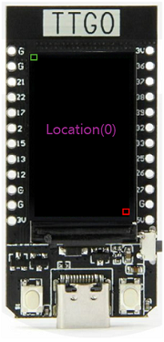
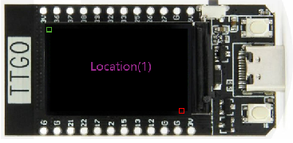
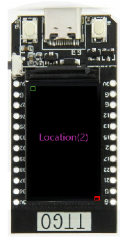
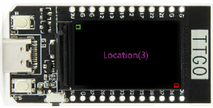

# 설명

TFT_eSPI를 사용할때 화면 회전 방향및 크기를 보여주기 위한 샘플 코드다. 원래 이 코드는 화면 크기를 확인하기위해 만들었던 코드다.

화면 회전은 간단하게 **setRotation** 함수를 사용하면된다.

회전 값은 0 ~ 3 까지 값을 이용하고 있다.

```c
// 스크린 회전 : 0~3, BMP drawing 에 대해서는 4~7
tft.setRotation(cur_location);
```

**setRotation** 값에 대한 그림은 아래와 같다. 녹색 상자가 시작점이고 빨간색 점이 끝점이다.

   